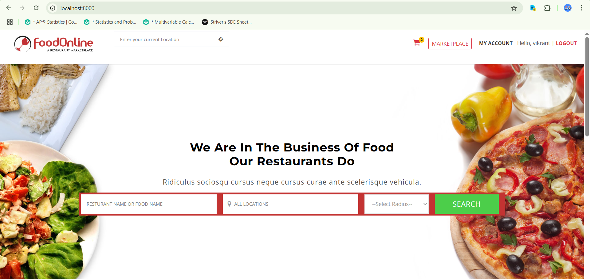
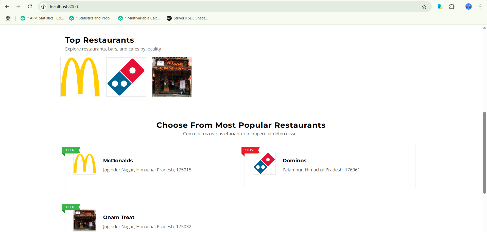
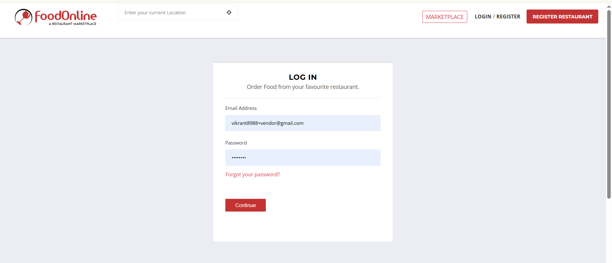
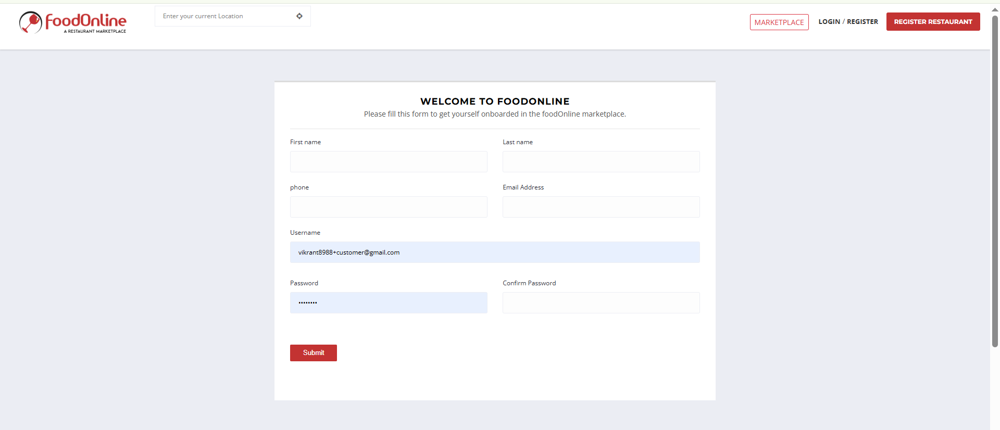
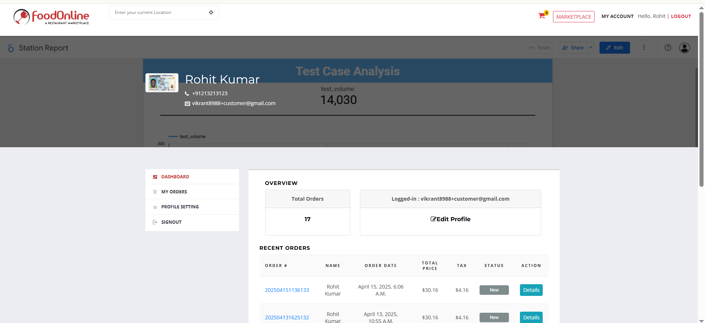
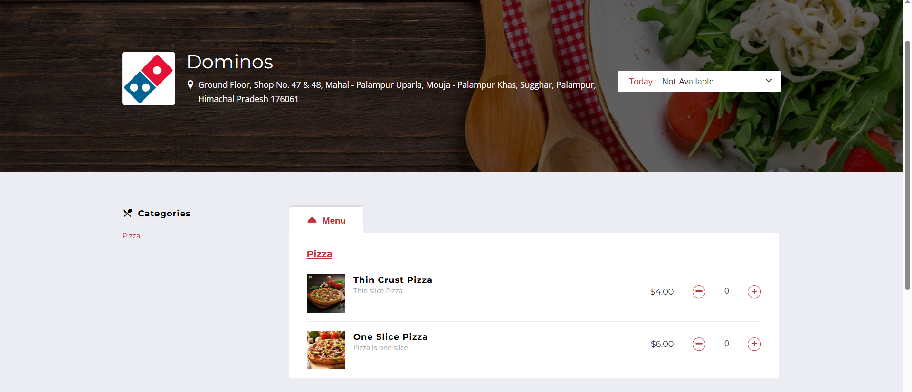
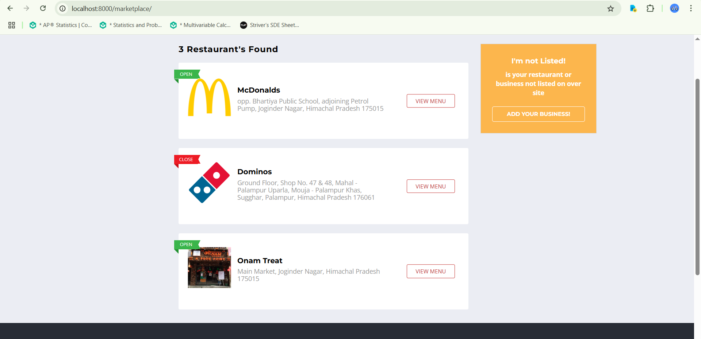
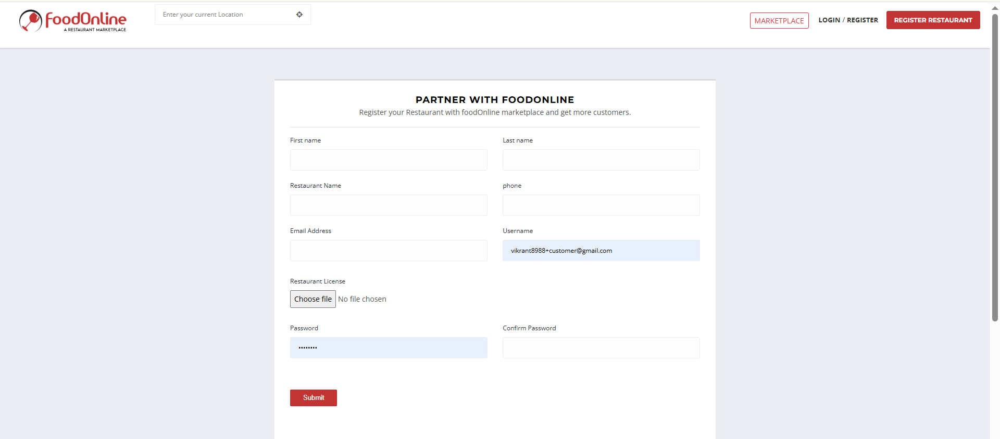
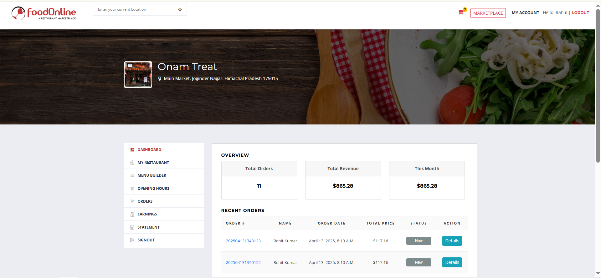

# 🍽️ Multi-Vendor Restaurant Marketplace (Django)

This is a **full-featured Multi-Vendor Restaurant Marketplace** web application built with **Python Django**. The platform allows multiple restaurant vendors to register, manage their profiles, and offer food items to customers based on **location-based search**, **proximity filters**, and other dynamic features.


## 📸 App Screenshots

### 🏠 Homepage




### 🔐 Login


### 📝 User Signup


### 📊 User Dashboard


### 🍔 Food Item View


### 🏪 Marketplace


### 📝 Vendor Signup


### 📊 Vendor Dashboard


---

## 🚀 Features

- 🔐 Vendor and Customer Authentication
- 🏪 Multi-vendor system with separate dashboards
- 📍 Location-based and nearby restaurant search
- 📦 Dynamic menu and product management for vendors
- 🔎 Advanced search and filtering system
- 🧭 Geolocation integration
- 🛒 Cart and order functionality (if applicable)
- 📬 Contact, feedback, or support features
- ☁️ Ready for production deployment

---

## 🛠️ Tech Stack

- **Backend:** Django (Python)
- **Frontend:** HTML5, CSS3, JavaScript
- **Database:** SQLite (default) or PostgreSQL (recommended for production)
- **APIs:** Google Maps API or GeoDjango (for location features)
- **Deployment:** Heroku, PythonAnywhere, or any cloud platform

---

## 🚧 Prerequisites

To run this project locally:

- Python 3.8+
- pip and virtualenv
- Basic knowledge of Django and frontend technologies

---

## ⚙️ Installation & Setup

1. **Clone the repository**

```bash
git clone https://github.com/vikrant8988/food-online
cd restaurant-marketplace
